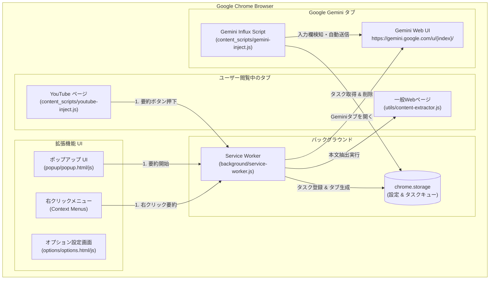
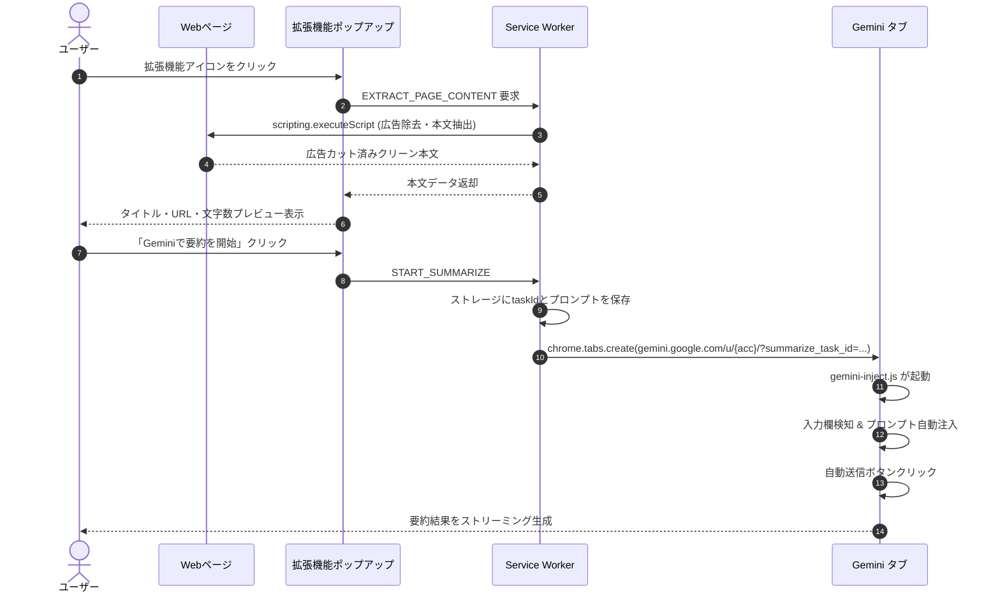
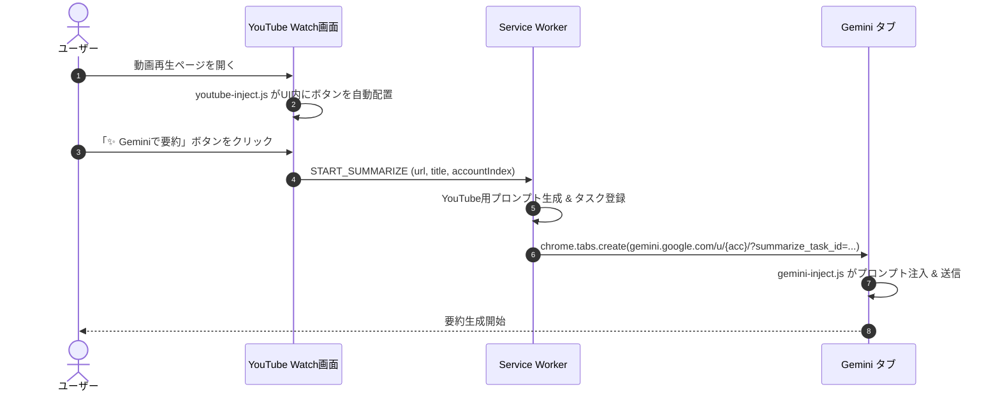
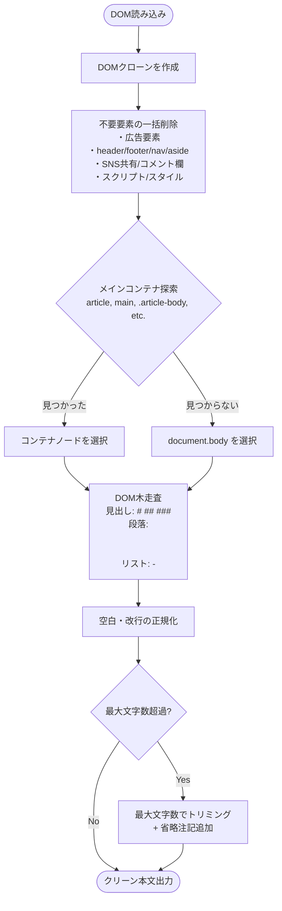

# システム設計書 (Architecture & System Design)

**プロジェクト名**: Web & YouTube to Gemini Summarizer  
**アーキテクチャ**: Chrome Extension (Manifest V3)

---

## 1. 全体アーキテクチャ図

---

## 2. 処理シーケンス

### 2.1 Webページ要約フロー (広告カット)

### 2.2 YouTube画面内ボタン要約フロー

---

## 3. スマート本文抽出アルゴリズム (`utils/content-extractor.js`)

---

## 4. ディレクトリ・モジュール責務一覧

| ディレクトリ / ファイル | 責務・役割 |
| :--- | :--- |
| `manifest.json` | 拡張機能のメタデータ、権限（`storage`, `tabs`, `contextMenus`, `scripting`）、ホスト権限定義 |
| `utils/content-extractor.js` | 広告・ノイズの自動除去とメイン本文の構造化抽出エンジン |
| `utils/defaults.js` | 初期設定、プロンプトテンプレート、マイグレーション、URL生成ヘルパー |
| `background/service-worker.js` | コンテキストメニュー制御、タスク登録、Geminiタブ生成、メッセージ中継 |
| `content_scripts/youtube-inject.js` | YouTube画面への要約ボタン配置、SPA遷移監視、セーフティネット監視 |
| `content_scripts/youtube-inject.css` | YouTube画面内ボタン・ドロップダウンメニューのスタイリング |
| `content_scripts/gemini-inject.js` | Gemini画面での入力欄検知、プロンプト自動注入、自動送信、ステータストースト |
| `popup/` | ポップアップUI（Web/YouTube自動判別、文字数プレビュー、テンプレート選択） |
| `options/` | 設定画面UI（アカウント管理、テンプレート編集、最大文字数設定） |
| `icons/` | 16x16, 48x48, 128x128 のPNGアイコンアセット |
| `generate_icons.py` | 依存ライブラリなしでPNGアイコンを自動生成するスクリプト |
| `REQUIREMENTS.md` | 機能要件・非機能要件定義書 |
| `ARCHITECTURE.md` | 本システム設計書 |
| `README.md` | ユーザー向け利用マニュアル・インストール手順書 |
| `CHROMEWEBSTORE.md` | Chrome Web Store公開用メタデータ・権限正当性ドキュメント |
